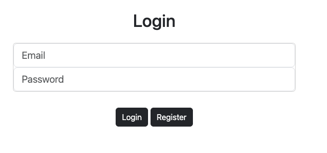

# Shiori

    > Simple app to create playlists, upload files (WAV only at the moment) and play them later 

### Usage

Run ``docker compose up -d``
Above command will start a mysql database at **localhost:3307** and the app at **http://localhost:5050**,
once you open the app it will show you the login page

       

You will need to register to start using the app

       

After that you can start creating playlists and uploading files to them

  
  

You can also check the swagger endpoint **http://localhost:5050/swagger/index.html** 
(Don't forget to set the bearer token when calling protected apis)

       

## Things to improve

* A claims user store would be good to have
* AI could be used to suggest playlists names to the user based on what the user will upload
* UI improvements (colors, be able to navigate to media pages, validations)
* Add pagination to the endpoints that returns a list of results (e.g: playlist, medias)